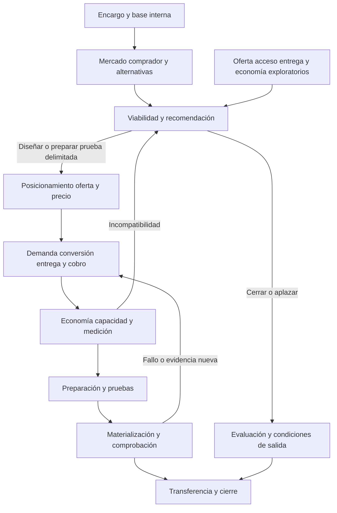

# Arquitectura metodológica de Go2Rev

Versión 0.2 · 10 de septiembre de 2026 · Base aceptada por Carlos Estrada · Archivo del producto

## Arquitectura y finalidad de construcción

Go2Rev se organiza como un sistema de decisiones sobre una iniciativa y su mercado, con diecisiete nodos funcionales y una base de conocimiento compartida. Los nodos distinguen trabajos intelectuales que en las fuentes de diseño estaban concentrados en D2, G1 y G3. Conservan la correspondencia con los once pasos existentes y las fases Diagnostic, Design y Despliegue. No equivalen a diecisiete documentos, reuniones o skills.

La promesa aceptada exige resolver la conexión entre comprador, oferta, acceso, venta, entrega y cobro, y comprobar la preparación del recorrido contratado. Para conseguirlo hay que diseñar también conocimiento interno, investigación externa, posicionamiento, precio, medición y criterios de decisión. La construcción se deriva de esa promesa y de los contratos de cada capacidad. Cada pieza debe formar parte del producto final.

Carlos ha aceptado esta arquitectura y ha fijado la construcción completa de la metodología antes de probarla. La primera base es enteramente teórica y no ha habido clientes. Las instrucciones, plantillas, modelos y protocolos que desarrollan esta arquitectura se localizan en el [paquete fundacional](../../paquete_fundacional/v0.1/LEEME.md). Los nodos siguientes describen la futura prestación; durante el desarrollo se redacta su funcionamiento, sin ejecutar actuaciones de negocio.

## Decisiones de arquitectura aceptadas

1. **Mantener los once pasos como correspondencia histórica y de transición.** La arquitectura utiliza nombres funcionales y códigos N01–N17 para identificar productores y consumidores. La entrada de prestación se rige por estos contratos. Los once pasos se conservan como correspondencia de diseño en 05; las instrucciones de origen no constituyen una entrada operativa de la versión fundacional.
2. **Dar entidad propia a comprador, alternativas, posicionamiento, oferta y precio, demanda, entrega y cobro, y medición.** Pueden compartir un documento, pero cada capacidad debe aportar un análisis identificable y alimentar decisiones posteriores.
3. **Usar versiones exploratorias en Diagnostic antes de comprometer el sistema del cliente.** Diagnostic necesita una representación inicial de oferta, acceso, capacidad y economía. No necesita el precio definitivo ni todo el diseño. Las versiones exploratorias habilitan comparación; las versiones destinadas a operar exigen condiciones más fuertes.
4. **Separar suficiencia de evidencia, calidad del análisis, autorización y preparación.** Una recomendación puede ser razonable para una prueba reversible y seguir sin justificar un lanzamiento. Una aprobación no aumenta la evidencia disponible.
5. **Mantener la preparación operativa dentro de Go2Rev.** Se diseña la medición y se materializan las piezas necesarias del recorrido contratado. CRM, contenidos, medios o integraciones se incorporan según necesidad y alcance, sin imponer un stack ni heredar todos los nodos de RevOS.

## Mapa funcional

| Fase principal | Nodos y decisiones | Conocimiento que debe quedar producido |
|---|---|---|
| Diagnostic | N01 Encargo; N02 Base interna; N03 Mercado y acceso; N04 Comprador y compra; N05 Alternativas; N06 Viabilidad y recomendación | Qué iniciativa se evalúa, qué puede transferirse, quién podría comprar y por qué, qué alternativas compiten, qué condiciones harían viable o inviable la ruta y qué merece preparación |
| Design | N07 Posicionamiento; N08 Oferta y precio; N09 Demanda; N10 Conversión; N11 Entrega y cobro; N12 Economía y capacidad; N13 Medición; N14 Preparación y protocolos | Una combinación comercial coherente, sus mecanismos, recursos, compromisos, incertidumbres, límites y medios de observación |
| Despliegue | N15 Materialización; N16 Comprobación; N17 Transferencia y cierre | Qué piezas funcionan en qué condiciones, quién puede utilizarlas, qué permanece abierto y dónde termina el acompañamiento |

N02 mantiene información durante todo el servicio. N03–N05 se reabren si cambia el mercado, el comprador o una premisa material. N08–N12 aportan versiones exploratorias a Diagnostic; N13 y N14 se anticipan cuando hace falta producir evidencia antes de una decisión. La fase expresa la finalidad del trabajo y el compromiso asumido, no un bloqueo cronológico de capacidades.

El diagrama orienta la lectura. Los contratos de dependencia, incluidas las iteraciones, se detallan en 04_dependencias_y_gobernanza.md; no se deducen solo de las flechas.

## Dos recorridos y variantes de negocio

**Oferta existente en contexto nuevo.** La experiencia de origen es una base para formular hipótesis de transferencia. Se comparan, por separado, necesidad, unidad de compra, roles, alternativas, confianza, acceso, precio, canal, entrega y requisitos del destino. Cada elemento sale como reutilizable con fundamento, adaptable o pendiente de contraste local. Un coste de origen puede servir como componente, pero debe añadirse el esfuerzo de localización, acceso, soporte, logística o intermediación que corresponda. Las ventas de origen no prueban aceptación en destino.

**Nueva iniciativa.** La base es una oferta representable, capacidades actuales o una vía verificable para habilitarlas y recursos para aprender. Ante ausencia de histórico, se construyen descomposición de trabajo, presupuestos documentados, observación de tareas análogas y escenarios. Se conserva la diferencia entre interés declarado, conducta, compra y uso. Una empresa matriz con histórico no convierte por sí sola la nueva iniciativa en negocio probado.

**Variantes de operación.** Cada nodo declara aplicabilidad. Venta directa, distribución, autoservicio o combinación cambian participantes, unidades y traspasos. En canal se separan compra del intermediario y demanda final; en producto físico, inventario, devoluciones y garantías; en servicios, horas, calidad y retrabajo; en recurrencia, renovación y abandono solo cuando formen parte del modelo. Los contratos comunes no exigen suscripción, MQL/SQL, un anticipo ni un ciclo de semanas.

Cuando una variante necesita capacidades todavía no implementadas, se registra la cobertura pendiente. La arquitectura B2B permite diseñarlas; no anuncia prestación general de todos los sectores o países. B2C conserva su estado conceptual, sin cobertura de lanzamiento acreditada.

## Entregas de cliente

Se mantienen los cinco conjuntos aceptados en Producto y método. La siguiente agrupación define usos, no archivos obligatorios.

| Conjunto | Contenido y nodos productores | Condición de recepción |
|---|---|---|
| Evaluación de oportunidad y viabilidad | N01–N06 y versiones exploratorias N08–N12; recomendación, alternativas, condiciones y evidencia pendiente | Permite continuar, ajustar, probar, aplazar o cerrar; explica qué podría cambiar la recomendación |
| Diseño del sistema comercial | N07–N11 y N13; comprador, promesa, oferta, precio, demanda, conversión, entrega/cobro y decisiones de seguimiento | La ruta completa resulta compatible con la economía N12 y el alcance N01 |
| Modelo económico editable | N12 con unidades y condiciones de N08–N11; supuestos, cálculo, escenarios y umbrales | Reproduce resultados pertinentes y conserva las magnitudes que no pueden calcularse |
| Kit inicial de operación | N15 a partir de N07–N14; materiales y medios necesarios para las tareas contratadas | Contiene contenido utilizable, reglas de avance y registro; configuración descrita y configuración ejecutada están separadas |
| Despliegue y transferencia | N14–N17; responsables, pruebas, resultados, límites, guía y siguiente revisión | El cierre se corresponde con lo observado; permite continuidad autónoma sin RevOS ni un LLM obligatorio |

El expediente conserva fuentes, cálculos y decisiones. La vista de cliente explica contexto, conclusión, razonamiento y uso esperado. Los códigos y controles internos quedan como trazabilidad secundaria. Una vista no adquiere autoridad distinta de sus fuentes.

## Cobertura de la promesa

| Requisito aceptado | Cobertura propuesta | Condición que evita una conclusión excesiva |
|---|---|---|
| Iniciativa y mercado prioritarios | N01, N03, N04, N06 | El diagnóstico puede seleccionar entre alternativas acotadas; no se exige traer el segmento resuelto |
| Investigación que descubre y contrasta | N02–N05 y N12 | Debe examinar factores omitidos y premisas materiales; no basta ordenar el brief |
| Diseño conectado | N07–N13 | Cruces comprador–oferta, promesa–capacidad, demanda–conversión y ventas–entrega–caja |
| Preparación operativa comprobada | N14–N16 | Tarea representativa de cada recorrido crítico, medios y operador efectivos |
| Acompañamiento acotado | N01, N14, N17 | Acciones, responsables, revisiones y finalización acordados para la prestación |
| Salida Diagnostic desde contratación | N01, N06, N17 | Entrega de evaluación y tratamiento del trabajo no ejecutado previstos desde el encargo |
| Autonomía de RevOS | N17 | Materiales, responsables y siguiente decisión utilizables al cierre |
| Conversación y LLM agnostic | Contratos comunes, N02, N15–N17 | Archivos recuperables, adaptaciones de capacidad y permisos, sin lógica comercial por proveedor |
| Aprendizaje posterior a la construcción | Gobierno de cambios | Incorporar mejoras justificadas después de utilizar la versión fundacional, preservando sus fuentes generales |

## Cómo leer y desarrollar la arquitectura

02_informacion_y_contratos.md especifica cómo producir conocimiento y qué significa cada registro. 03_nodos_y_entregables.md define el trabajo de los diecisiete nodos. 04_dependencias_y_gobernanza.md fija iteración, calidad y decisiones. 05_reutilizacion_y_fuentes.md distingue contenido realmente leído de material solamente inventariado. 06_construccion_y_revision.md fija los componentes y criterios de una versión utilizable. El paquete fundacional localiza su desarrollo sustantivo.

El Plan mantiene el backlog de construcción. El asistente desarrolla instrucciones, contratos, plantillas vacías, modelos generales, protocolos y guías. Carlos revisa decisiones de producto. La revisión durante esta etapa es documental; las pruebas de la metodología se abrirán solo después de completar e integrar todas las piezas del alcance declarado.
